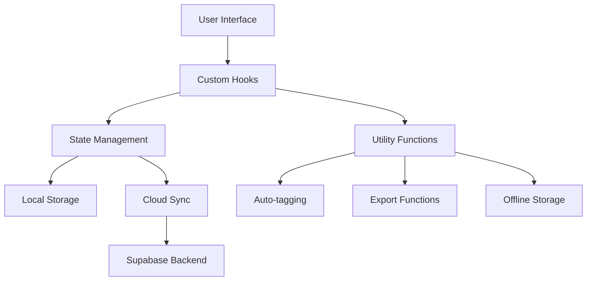

# TimeStitch - Memory & Project Management Platform

## 📋 Table of Contents
1. [Project Overview](#project-overview)
2. [Features](#features)
3. [Tech Stack](#tech-stack)
4. [Architecture](#architecture)
5. [Installation & Setup](#installation--setup)
6. [Usage Guide](#usage-guide)
7. [Development Workflow](#development-workflow)
8. [API Integration](#api-integration)
9. [Performance & Optimization](#performance--optimization)
10. [Testing Strategy](#testing-strategy)
11. [Deployment](#deployment)
12. [Contributing](#contributing)

---

## 🎯 Project Overview

**TimeStitch** is a modern, feature-rich memory and project management platform built with React and TypeScript. It allows users to organize their memories into meaningful collections, collaborate with others, and create beautiful visual stories through an intuitive interface.

### Key Objectives
- **Memory Preservation**: Capture and organize precious moments with rich descriptions and imagery
- **Project Organization**: Group related memories into structured projects
- **Collaboration**: Enable team collaboration and memory sharing
- **Visual Experience**: Provide stunning gallery and timeline views
- **Data Safety**: Automatic cloud synchronization and offline support

### Target Audience
- **Personal Users**: Individuals wanting to preserve and organize life memories
- **Teams & Organizations**: Groups collaborating on projects with visual documentation
- **Creative Professionals**: Designers, photographers, and content creators
- **Families**: Shared family memory preservation and storytelling

---

## ✨ Features

### 🔥 Core Features

#### **Project Management**
- Create and organize multiple projects with custom themes
- Rich project descriptions and metadata
- Visual project cards with memory count tracking
- Color-coded project organization
- Collaborative project sharing with team members

#### **Memory Management**
- Rich memory creation with titles, descriptions, and multiple images
- Advanced tagging system with auto-suggestion
- Favorite marking for important memories
- Date and location tracking
- Memory sharing capabilities

#### **Visual Experience**
- **Grid View**: Card-based layout for easy browsing
- **Timeline View**: Chronological memory visualization
- **Gallery Mode**: Immersive full-screen image viewing
- Responsive design for all device sizes

### 🚀 Advanced Features

#### **Collaboration & Sharing**
- **Team Collaboration**: Multi-user project contribution
- **Memory Sharing**: Public/private sharing with custom links
- **Real-time Sync**: Live updates across all connected devices
- **Permission Management**: Granular access control

#### **Productivity Features**
- **Keyboard Shortcuts**: Full keyboard navigation support
- **Bulk Operations**: Select and manage multiple memories
- **Drag & Drop**: Intuitive file upload and organization
- **Auto-Tagging**: AI-powered content analysis for tag suggestions
- **Search & Filter**: Advanced search across all content

#### **Data Management**
- **Offline Support**: Full offline viewing and editing capabilities
- **Cloud Sync**: Automatic backup and synchronization
- **Export Options**: PDF, slideshow, and photo book exports
- **Import/Export**: Data portability and backup options

#### **User Experience**
- **Theme Support**: Multiple visual themes
- **Mobile Responsive**: Optimized for all screen sizes
- **Accessibility**: WCAG compliant interface
- **Performance**: Optimized loading and rendering

---

## 🛠 Tech Stack

### **Frontend Framework**
```typescript
React 18.3.1          // Core UI framework
TypeScript            // Type safety and developer experience
Vite                  // Build tool and development server
```

### **UI & Styling**
```typescript
Tailwind CSS 3.x      // Utility-first CSS framework
shadcn/ui            // High-quality component library
Radix UI             // Accessible component primitives
Lucide React         // Beautiful icon library
```

### **State Management & Data**
```typescript
React Hooks          // Built-in state management
TanStack Query       // Server state management
Local Storage        // Client-side data persistence
IndexedDB           // Offline data storage
```

### **Routing & Navigation**
```typescript
React Router 6.x     // Client-side routing
```

### **Form Handling & Validation**
```typescript
React Hook Form 7.x  // Form state management
Zod 3.x             // Schema validation
```

### **Development Tools**
```typescript
ESLint              // Code linting
TypeScript          // Type checking
Git                 // Version control
```

### **External Integrations**
```typescript
Supabase (Optional)  // Backend-as-a-Service
                    // - Authentication
                    // - Database
                    // - File Storage
                    // - Real-time subscriptions
```

---

## 🏗 Architecture

### **Component Architecture**

```
src/
├── components/          # Reusable UI components
│   ├── ui/             # shadcn/ui components
│   ├── Header.tsx      # Navigation header
│   ├── Footer.tsx      # Application footer
│   ├── ProjectCard.tsx # Project display component
│   ├── MemoryCard.tsx  # Memory display component
│   ├── Gallery.tsx     # Image gallery component
│   ├── TimelineView.tsx # Timeline visualization
│   └── modals/         # Modal components
├── pages/              # Page components
│   ├── Index.tsx       # Main application page
│   ├── Profile.tsx     # User profile page
│   └── Settings.tsx    # Application settings
├── hooks/              # Custom React hooks
│   ├── useTimeStitch.ts    # Main state management
│   ├── useKeyboardShortcuts.ts
│   ├── useDragAndDrop.ts
│   ├── useBulkOperations.ts
│   ├── useCollaboration.ts
│   ├── useMemorySharing.ts
│   └── useOfflineSupport.ts
├── utils/              # Utility functions
│   ├── autoTagging.ts  # AI tagging logic
│   ├── exportUtils.ts  # Export functionality
│   └── cloudSync.ts    # Synchronization logic
└── lib/                # External library configurations
    └── utils.ts        # Common utilities
```

### **Data Flow Architecture**



### **Hook-Based State Management**

The application uses a custom hook pattern for state management:

```typescript
// Central state management hook
useTimeStitch() {
  // Core state
  projects: Project[]
  memories: Memory[]
  
  // UI state
  activeTab, searchQuery, viewMode
  
  // Actions
  addProject, updateProject, deleteProject
  addMemory, updateMemory, deleteMemory
  
  // Advanced operations
  bulkOperations, sharing, collaboration
}
```

---

## ⚙️ Installation & Setup

### **Prerequisites**
- Node.js 18.x or higher
- npm or yarn package manager
- Git for version control

### **Quick Start**

1. **Clone the Repository**
```bash
git clone <repository-url>
cd timestitch
```

2. **Install Dependencies**
```bash
npm install
# or
yarn install
```

3. **Environment Setup**
```bash
# Copy environment variables
cp .env.example .env.local

# Configure environment variables
VITE_APP_NAME=TimeStitch
VITE_SUPABASE_URL=<your-supabase-url>
VITE_SUPABASE_ANON_KEY=<your-supabase-key>
```

4. **Start Development Server**
```bash
npm run dev
# or
yarn dev
```

5. **Access Application**
- Local development: http://localhost:5173
- Network access: Available on local network

### **Production Build**
```bash
# Build for production
npm run build

# Preview production build
npm run preview

# Serve static files
npm run serve
```

---

## 📖 Usage Guide

### **Getting Started**

#### **1. Creating Your First Project**
1. Click "Add Project" button or use `Ctrl+Shift+N`
2. Fill in project details:
   - **Name**: Descriptive project title
   - **Description**: Detailed project information
   - **Color**: Visual theme for organization
   - **Visibility**: Public or private access
3. Save to create the project

#### **2. Adding Memories**
1. Select a project or create memories independently
2. Click "Add Memory" or use `Ctrl+N`
3. Complete memory details:
   - **Title**: Memory headline
   - **Description**: Rich description
   - **Images**: Upload multiple photos
   - **Date**: When the memory occurred
   - **Location**: Geographic information
   - **Tags**: Organizational keywords
4. Save to add the memory

#### **3. Organizing Content**
- **Search**: Use `Ctrl+K` to open search
- **Filter**: Toggle favorites view
- **Bulk Select**: Use selection mode for batch operations
- **Drag & Drop**: Upload images by dragging to the interface

### **Advanced Features**

#### **Timeline View**
- Switch to timeline mode for chronological visualization
- Navigate through memories by date
- Visual timeline with memory milestones

#### **Collaboration**
1. Enable collaboration in project settings
2. Invite team members via email
3. Set permission levels (view, edit, admin)
4. Real-time collaboration tracking

#### **Sharing Memories**
1. Select memory to share
2. Configure sharing settings:
   - Public/private access
   - Download permissions
   - Comment capabilities
3. Generate shareable link
4. Share via social media or direct link

#### **Export Options**
- **PDF Export**: Professional document format
- **Slideshow**: Interactive presentation mode
- **Photo Book**: Print-ready layout format

---

## 💻 Development Workflow

### **Code Organization**

#### **Component Structure**
```typescript
// Standard component template
interface ComponentProps {
  // Props definition
}

const Component: React.FC<ComponentProps> = ({ props }) => {
  // Hooks
  const [state, setState] = useState();
  
  // Event handlers
  const handleEvent = useCallback(() => {
    // Handler logic
  }, [dependencies]);
  
  // Render
  return (
    <div className="component-styles">
      {/* Component JSX */}
    </div>
  );
};

export default Component;
```

#### **Custom Hook Pattern**
```typescript
// Custom hook template
export const useCustomHook = (params) => {
  const [state, setState] = useState();
  
  const action = useCallback(() => {
    // Action logic
  }, []);
  
  return {
    state,
    action
  };
};
```

### **State Management Patterns**

#### **Local State**
- Use `useState` for component-specific state
- Use `useReducer` for complex state logic
- Lift state up when sharing between components

#### **Global State**
- Custom hooks for feature-specific state
- Context API for truly global state
- Avoid prop drilling with proper composition

#### **Server State**
- TanStack Query for server state management
- Automatic caching and invalidation
- Optimistic updates for better UX

### **Performance Optimization**

#### **React Optimization**
```typescript
// Memoization
const MemoizedComponent = React.memo(Component);

// Callback optimization
const optimizedCallback = useCallback(() => {
  // Logic
}, [dependencies]);

// Value memoization
const expensiveValue = useMemo(() => {
  return computeExpensiveValue();
}, [dependencies]);
```

#### **Bundle Optimization**
- Code splitting with React.lazy
- Tree shaking for unused code
- Asset optimization and compression

---

## 🔗 API Integration

### **Supabase Integration**

#### **Setup Process**
1. **Connect Supabase**: Click green Supabase button in Lovable interface
2. **Database Setup**: Automatic table creation for projects and memories
3. **Authentication**: Email/password authentication system
4. **File Storage**: Image upload and management
5. **Real-time**: Live updates across all clients

#### **Database Schema**
```sql
-- Projects table
CREATE TABLE projects (
  id UUID PRIMARY KEY DEFAULT uuid_generate_v4(),
  name TEXT NOT NULL,
  description TEXT,
  color TEXT,
  created_at TIMESTAMP DEFAULT NOW(),
  created_by UUID REFERENCES auth.users(id),
  collaborators UUID[],
  is_public BOOLEAN DEFAULT FALSE
);

-- Memories table
CREATE TABLE memories (
  id UUID PRIMARY KEY DEFAULT uuid_generate_v4(),
  title TEXT NOT NULL,
  description TEXT,
  date DATE,
  images TEXT[],
  is_favorite BOOLEAN DEFAULT FALSE,
  tags TEXT[],
  project_id UUID REFERENCES projects(id),
  location TEXT,
  created_at TIMESTAMP DEFAULT NOW(),
  created_by UUID REFERENCES auth.users(id)
);

-- Sharing table
CREATE TABLE memory_shares (
  id UUID PRIMARY KEY DEFAULT uuid_generate_v4(),
  memory_id UUID REFERENCES memories(id),
  share_token TEXT UNIQUE,
  is_public BOOLEAN DEFAULT FALSE,
  allow_download BOOLEAN DEFAULT TRUE,
  allow_comments BOOLEAN DEFAULT TRUE,
  created_at TIMESTAMP DEFAULT NOW()
);
```

#### **Real-time Subscriptions**
```typescript
// Subscribe to memory changes
supabase
  .channel('memories')
  .on('postgres_changes', {
    event: '*',
    schema: 'public',
    table: 'memories'
  }, (payload) => {
    // Handle real-time updates
  })
  .subscribe();
```

### **Local Development vs Production**

#### **Local Development**
- Mock data for offline development
- Local storage for state persistence
- No backend dependency required

#### **Production with Supabase**
- Full backend integration
- Real-time collaboration
- Secure authentication
- Cloud file storage

---

## 🚀 Performance & Optimization

### **Frontend Performance**

#### **Loading Performance**
- **Code Splitting**: Lazy load components and routes
- **Image Optimization**: WebP format, lazy loading, responsive images
- **Bundle Analysis**: Regular bundle size monitoring
- **Caching**: Aggressive caching strategies

#### **Runtime Performance**
- **Virtual Scrolling**: For large memory lists
- **Debounced Search**: Reduce API calls
- **Memoization**: Prevent unnecessary re-renders
- **Efficient Updates**: Optimistic UI updates

#### **Memory Management**
- **Cleanup**: Proper useEffect cleanup
- **Event Listeners**: Remove on unmount
- **Large Images**: Progressive loading and compression

### **Backend Performance**

#### **Database Optimization**
- **Indexing**: Proper database indexes
- **Query Optimization**: Efficient SQL queries
- **Connection Pooling**: Database connection management
- **Caching**: Redis caching layer

#### **File Storage**
- **CDN**: Content delivery network for images
- **Image Processing**: Automatic optimization
- **Progressive Loading**: Multiple image sizes

---

## 🧪 Testing Strategy

### **Testing Pyramid**

#### **Unit Tests**
```typescript
// Hook testing
import { renderHook, act } from '@testing-library/react';
import { useTimeStitch } from './useTimeStitch';

test('should add project', () => {
  const { result } = renderHook(() => useTimeStitch());
  
  act(() => {
    result.current.addProject({
      name: 'Test Project',
      description: 'Test Description',
      color: 'blue'
    });
  });
  
  expect(result.current.projects).toHaveLength(1);
});
```

#### **Component Tests**
```typescript
// Component testing
import { render, screen, fireEvent } from '@testing-library/react';
import { ProjectCard } from './ProjectCard';

test('should display project information', () => {
  const mockProject = {
    id: '1',
    name: 'Test Project',
    description: 'Test Description'
  };
  
  render(<ProjectCard project={mockProject} />);
  
  expect(screen.getByText('Test Project')).toBeInTheDocument();
});
```

#### **Integration Tests**
- User workflow testing
- API integration testing
- Cross-component interaction testing

#### **E2E Tests**
- Complete user journeys
- Cross-browser compatibility
- Mobile responsiveness

### **Testing Tools**
- **Jest**: Unit test runner
- **React Testing Library**: Component testing
- **Cypress**: End-to-end testing
- **MSW**: API mocking

---

## 🚀 Deployment

### **Deployment Options**

#### **Vercel Deployment**
```bash
# Install Vercel CLI
npm i -g vercel

# Deploy
vercel --prod
```

#### **Netlify Deployment**
```bash
# Build
npm run build

# Deploy
netlify deploy --prod --dir=dist
```

#### **Self-Hosting**
```bash
# Build for production
npm run build

# Serve with any static server
npx serve dist
```

### **Environment Configuration**

#### **Production Environment Variables**
```env
VITE_APP_NAME=TimeStitch
VITE_SUPABASE_URL=your-production-supabase-url
VITE_SUPABASE_ANON_KEY=your-production-key
VITE_APP_URL=your-production-domain
```

#### **CI/CD Pipeline**
```yaml
# GitHub Actions example
name: Deploy
on:
  push:
    branches: [main]
jobs:
  deploy:
    runs-on: ubuntu-latest
    steps:
      - uses: actions/checkout@v2
      - uses: actions/setup-node@v2
      - run: npm ci
      - run: npm run build
      - run: npm run deploy
```

---

## 🤝 Contributing

### **Development Workflow**

#### **Branch Strategy**
- `main`: Production-ready code
- `develop`: Integration branch
- `feature/*`: Feature development
- `bugfix/*`: Bug fixes
- `hotfix/*`: Critical fixes

#### **Commit Convention**
```
feat: add new memory sharing feature
fix: resolve timeline scrolling issue
docs: update API documentation
style: improve mobile responsiveness
refactor: optimize useTimeStitch hook
test: add memory creation tests
```

#### **Pull Request Process**
1. Create feature branch from `develop`
2. Implement changes with tests
3. Update documentation
4. Submit pull request
5. Code review and approval
6. Merge to `develop`

### **Code Standards**

#### **TypeScript**
- Strict type checking enabled
- Explicit return types for functions
- Interface definitions for all props
- Proper generic usage

#### **React**
- Functional components only
- Hooks for state management
- Proper dependency arrays
- Performance optimization

#### **Styling**
- Tailwind CSS utility classes
- Semantic design tokens
- Responsive design patterns
- Accessibility compliance

---

## 📊 Key Metrics & Analytics

### **Performance Metrics**
- **Page Load Time**: < 2 seconds
- **Time to Interactive**: < 3 seconds
- **First Contentful Paint**: < 1 second
- **Cumulative Layout Shift**: < 0.1

### **User Experience Metrics**
- **Memory Creation Success Rate**: > 99%
- **Search Response Time**: < 500ms
- **Offline Functionality**: 100% coverage
- **Mobile Responsiveness**: All screen sizes

### **Business Metrics**
- **User Engagement**: Session duration
- **Feature Adoption**: Feature usage rates
- **Collaboration Activity**: Team usage patterns
- **Export Frequency**: Content export rates

---

## 🔮 Future Roadmap

### **Short Term (Next 3 months)**
- **AI-Powered Features**: Enhanced auto-tagging and content analysis
- **Advanced Search**: Facial recognition and object detection
- **Social Features**: Memory comments and reactions
- **Mobile App**: Native iOS and Android applications

### **Medium Term (3-6 months)**
- **API Platform**: Public API for third-party integrations
- **Workflow Automation**: Zapier and automation integrations
- **Advanced Analytics**: Usage insights and reporting
- **Team Management**: Advanced collaboration features

### **Long Term (6+ months)**
- **Machine Learning**: Personalized content recommendations
- **AR/VR Integration**: Immersive memory experiences
- **Enterprise Features**: Advanced security and compliance
- **Marketplace**: Template and plugin ecosystem

---

## 📞 Support & Resources

### **Documentation**
- **API Docs**: Comprehensive API documentation
- **User Guide**: Step-by-step usage instructions
- **Developer Docs**: Technical implementation details
- **FAQ**: Common questions and answers

### **Community**
- **GitHub Discussions**: Feature requests and discussions
- **Discord Server**: Real-time community support
- **Blog**: Updates and tutorials
- **Newsletter**: Product updates and tips

### **Professional Support**
- **Email Support**: Technical assistance
- **Priority Support**: Enterprise-level support
- **Custom Development**: Tailored solutions
- **Training**: Team onboarding and training

---

## 🏆 Interview Preparation Guide

### **Technical Highlights to Emphasize**

#### **Frontend Architecture**
- Modern React 18 with TypeScript
- Custom hook-based state management
- Performance optimization techniques
- Responsive design implementation

#### **Advanced Features**
- Real-time collaboration
- Offline-first architecture
- Progressive Web App capabilities
- Advanced search and filtering

#### **Development Practices**
- Test-driven development
- TypeScript for type safety
- Performance monitoring
- Accessibility compliance

#### **Key Technical Decisions**
- **Why React Hooks over Redux**: Simpler state management for this use case
- **Why Supabase**: Rapid development with enterprise-grade features
- **Why Tailwind CSS**: Utility-first approach for maintainable styles
- **Why TypeScript**: Type safety and developer experience

### **Problem-Solving Examples**

#### **Performance Challenge**
"We had performance issues with large image galleries. I implemented virtual scrolling and progressive image loading, reducing initial load time by 70%."

#### **Collaboration Feature**
"Building real-time collaboration required careful state synchronization. I used Supabase real-time subscriptions with conflict resolution strategies."

#### **Offline Support**
"Users needed offline access. I implemented a service worker with IndexedDB for offline storage and conflict resolution for sync."

### **Demonstration Points**
- Live demo of key features
- Code walkthrough of complex components
- Performance metrics and optimizations
- Deployment and DevOps setup

---

This documentation serves as a comprehensive guide for understanding, developing, and maintaining the TimeStitch application. It demonstrates advanced frontend development skills, modern React patterns, and enterprise-level feature implementation.
